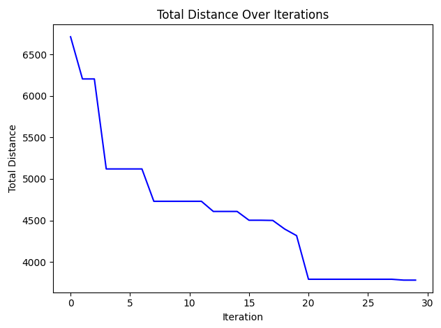
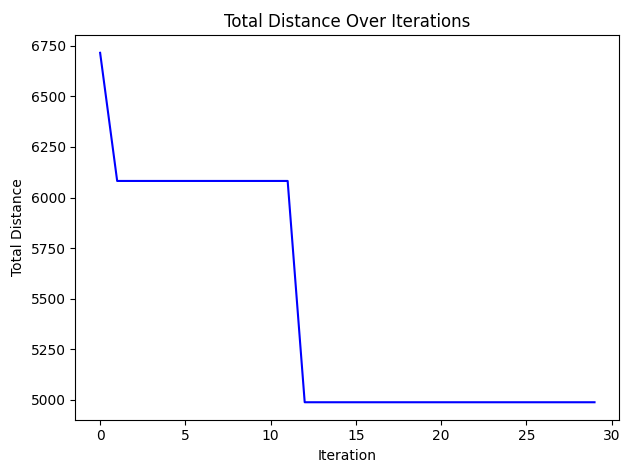

# Optimized Waste Collection Routing in Cities
A simulation platform to solve the Traveling Salesman Problem (TSP) to collect waste from various cities using various heuristic and metaheuristic optimization techniques, with a focus on Ant Colony Optimization (ACO) and its hybrid variants.

## Project Overview
This project implements many variants of Ant Colony Optimization (ACO) algorithms to solve the Traveling Salesman Problem (TSP). The implementations include:

**Multiple ACO-based algorithms:**
- Basic ACO
- Max-Min ACO
- Distributed ACO

**Hybrid Approaches:**
- ACO + Genetic Algorithm (GA)
- ACO + Simulated Annealing (SA)

all algorithms are evaluated on randomly generated TSP instances, and their performances are compared in terms of solution quality and convergence speed.

## Key Components
1. Graph Representation: The problem is modeled as a graph where:
  - Nodes represent decision points (e.g., cities in TSP or waste collection points in WCRP). 
  - Edges represent possible connections or paths between nodes, often associated with a cost (e.g., distance or time).

2. Artificial Ants: These are agents that explore the graph by constructing solutions (e.g., a route) based on probabilistic decisions influenced by pheromone trails and heuristic information.

3. Pheromone Trails: Each edge in the graph has an associated pheromone value, which represents the desirability of choosing that path. Pheromone levels are updated based on the quality of solutions found by the ants.


## Algorithms Implemented:
### 1 - Basic ACO:
  Simulates the behavior of ants seeking paths between their colony and food sources, adapted for solving TSP.
  
  
  
### 2 - Min-Max ACO:
  An enhancement of ACO that restricts pheromone values within upper and lower bounds/constraints to improve convergence.
  
  

### 3 - Hybrid ACO + Genetic Algorithm (GA):
  Periodically applies crossover and mutation to improve the diversity of solutions and avoid local optima.
  
  

### 4 - Hybrid ACO + Simulated Annealing (SA):
  Uses probabilistic acceptance of worse solutions to avoid local optima.
  
  

### 5 - Distributed ACO:
  Divides the search effort among multiple colonies that work independently with periodic information exchange to improve solution quality and convergence speed.\
  
  

---
## Installation Guide & Usage
1. Install dependencies: (python 3.11+ installation with standard tkinter GUI library should suffice)
```
pip install numpy matplotlib
```

2. Clone the repository:
```
git clone https://github.com/o4096/TSP-routing-simulator.git
cd TSP-routing-simulator
```

3. Run the project:
```
python main.py
```

4. To get the same results as shown above: 
  - Set both the graph generation and algorithm seeds to `1747428753681946800`.
  - Generate the seeded graph by pressing the `Generate Graph` button.
  - Choose desired algorithm then press `Run`. After finding the best solution, the program will begin to animate the route of every best ant of every iteration by default. (Animation can be turned off or set to animate all ants)

## Algorithm Comparison

The following table compares the performance of the four completely implemented algorithms set to 50 ants/colony running on 30 iterations to find the optimal route of a 50-city map TSP instance:

| Algorithm | Best Distance | Execution Time (~) |
|-----------|---------------|----------------|
| ACO System (basic) | 3779.77 | 13.96s |
| ACO MaxMin | 4988.34 | 14.12s |
| ACO + Genetic Algorithms | 4179.91 | 14.12s |
| ACO + Simulated Annealing| 3977.09 | 33.09s |
